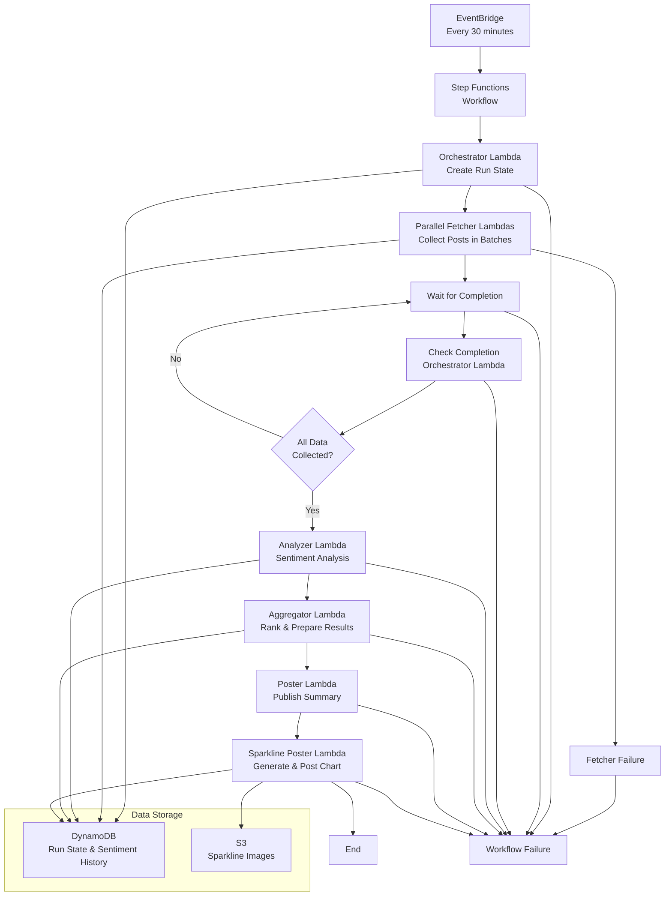

# Bluesky HourStats

A Go-based AT Protocol/Bluesky client that analyzes trending posts and sentiment to provide hourly statistics about the Bluesky community.

## Overview

Bluesky HourStats is an automated bot that:
- Searches all public posts from Bluesky/AT Protocol (not just followed accounts)
- Filters out adult content using Bluesky's official moderation labels
- Performs emotion-based sentiment analysis on trending content
- Posts hourly summaries with the top 5 most popular posts and overall community sentiment
- Uses engagement scores (likes + reposts + replies) to rank posts
- Can be deployed to cloud services for continuous operation

## Generated Post Format

The bot posts summaries in this format:
```
Bluesky is #satisfied

1. @username.bsky.social +
2. @anotheruser.bsky.social -
3. @thirduser.bsky.social x
4. @fourthuser.bsky.social +
5. @fifthuser.bsky.social x
```

**Features:**
- **Mood Hashtag**: Descriptive mood word (e.g., #satisfied, #excited, #concerned) from 100-word sentiment vocabulary
- **Top 5 posts**: Ranked by total engagement score with clickable links
- **Sentiment indicators**: + for positive, - for negative, x for neutral
- **Clickable links**: User handles link to their posts via Bluesky facets
- **Adult content filtering**: Uses Bluesky's official moderation labels
- **Deduplication**: Removes duplicate posts, keeping highest engagement version
- **48-Hour Sentiment Sparkline**: Visual chart showing sentiment trends over the last 48 hours


## Project Status

✅ **Production Ready** - Multi-Lambda serverless architecture deployed and running on AWS
✅ **Fully Automated** - EventBridge scheduling every 30 minutes with complete CI/CD pipeline
✅ **Scalable** - Handles thousands of posts per analysis cycle with parallel processing
✅ **Monitored** - Comprehensive logging and CloudWatch integration

## Features

- [x] AT Protocol/Bluesky API integration using official indigo library
- [x] Public post search (searches all public posts, not just followed accounts)
- [x] Adult content filtering using Bluesky's official moderation labels
- [x] Emotion-based sentiment analysis with 30+ emotions across positive/negative/neutral categories
- [x] Keyword-based sentiment fallback for improved accuracy
- [x] Engagement score calculation (likes + reposts + replies)
- [x] Time-filtered analysis (only considers new posts during the analysis interval)
- [x] Configurable analysis intervals (minutes)
- [x] Smart posting (skips when no posts found)
- [x] Clickable handle links with proper Bluesky rich text facets
- [x] Post deduplication (keeps highest engagement version)
- [x] Parallel post fetching (8 concurrent API calls)
- [x] Accurate sentiment calculation from all posts (not just top 5)
- [x] Dry-run mode for safe testing
- [x] Secure configuration management
- [x] Local testing environment with live posting capability
- [x] Comprehensive logging and debugging
- [x] AWS serverless deployment with orchestrated Lambda architecture
- [x] DynamoDB state management with efficient batch operations
- [x] Direct Lambda invocation (no Step Functions)
- [x] EventBridge scheduling for automated execution
- [x] CID extraction and storage for embed cards
- [x] Embed cards for top posts (rich post display with full content preview)
- [x] 48-hour sentiment sparkline visualization with PNG image generation
- [x] Historical sentiment data storage in DynamoDB
- [x] Embedded image posting to Bluesky (no external links)
- [x] Smart fallback for insufficient historical data

## Tech Stack

- **Language**: Go 1.24+
- **AT Protocol**: [Bluesky indigo library](https://github.com/bluesky-social/indigo)
- **Sentiment Analysis**: [GoVader](https://github.com/jonreiter/govader)
- **Image Generation**: Go graphics library (fogleman/gg)
- **Cloud Platform**: AWS (Lambda, Step Functions, DynamoDB, EventBridge)
- **State Management**: DynamoDB with TTL and GSI
- **Image Storage**: S3 with public read access
- **Orchestration**: AWS Step Functions
- **Scheduling**: AWS EventBridge (every 30 minutes)
- **Infrastructure**: Terraform with S3 remote state

## Long-Term Expectations

### Data Volume & Processing Requirements

#### **Current Scale (2025)**
- **Posts per analysis**: 1,000-5,000 posts every 30 minutes
- **Daily post volume**: ~50,000-240,000 posts analyzed
- **Storage requirements**: ~50MB/day (DynamoDB + S3)
- **Processing time**: 2-5 minutes per analysis cycle
- **Monthly cost**: ~$15-25 (AWS Lambda + DynamoDB + S3)

#### **Projected Growth (2026-2027)**
- **Posts per analysis**: 5,000-15,000 posts every 30 minutes
- **Daily post volume**: ~240,000-720,000 posts analyzed
- **Storage requirements**: ~200MB/day (DynamoDB + S3)
- **Processing time**: 5-10 minutes per analysis cycle
- **Monthly cost**: ~$50-100 (AWS Lambda + DynamoDB + S3)

#### **High Growth Scenario (2028+)**
- **Posts per analysis**: 15,000-50,000 posts every 30 minutes
- **Daily post volume**: ~720,000-2.4M posts analyzed
- **Storage requirements**: ~500MB/day (DynamoDB + S3)
- **Processing time**: 10-15 minutes per analysis cycle
- **Monthly cost**: ~$150-300 (AWS Lambda + DynamoDB + S3)

### Cost Breakdown Analysis

#### **AWS Lambda Costs**
- **Current**: $5-10/month (2,880 executions × 3 minutes × 1GB)
- **2026-2027**: $20-40/month (2,880 executions × 7 minutes × 1GB)
- **2028+**: $50-100/month (2,880 executions × 12 minutes × 1GB)

#### **DynamoDB Costs**
- **Current**: $5-10/month (50K reads/writes, 1GB storage)
- **2026-2027**: $15-30/month (200K reads/writes, 5GB storage)
- **2028+**: $40-80/month (500K reads/writes, 15GB storage)

#### **S3 Storage Costs**
- **Current**: $0.50/month (15GB sparkline images)
- **2026-2027**: $2/month (60GB sparkline images)
- **2028+**: $5/month (150GB sparkline images)

### Scalability Considerations

#### **Architecture Scaling Points**
1. **Lambda Memory**: Can increase from 1GB to 3GB for faster processing
2. **Parallel Processing**: Can add more fetcher Lambdas for higher throughput
3. **DynamoDB**: Can add read replicas and increase provisioned capacity
4. **S3**: Automatically scales with no configuration changes needed

#### **Performance Optimizations**
- **Batch Processing**: DynamoDB batch operations for efficient data storage
- **Connection Pooling**: Reuse HTTP connections for Bluesky API calls
- **Caching**: Implement Redis for frequently accessed sentiment data
- **CDN**: CloudFront distribution for sparkline images

#### **Monitoring & Alerting**
- **CloudWatch Metrics**: Track Lambda duration, DynamoDB throttling, S3 requests
- **Cost Alerts**: Set up billing alerts for unexpected cost increases
- **Performance Alerts**: Monitor for processing time increases or failures

### Data Retention Strategy

#### **DynamoDB TTL**
- **Run State**: 2 days (automatic cleanup)
- **Sentiment History**: 7 days (for sparkline generation)
- **Total Storage**: Minimal impact on costs

#### **S3 Lifecycle Policies**
- **Sparkline Images**: 30 days standard, then move to IA, then Glacier
- **Cost Optimization**: Reduces storage costs by 60-80% over time

### Future Feature Considerations

#### **Potential Enhancements**
- **Real-time Processing**: Kinesis Data Streams for continuous analysis
- **Machine Learning**: SageMaker integration for improved sentiment analysis
- **Multi-language Support**: Expand beyond English sentiment analysis
- **Advanced Visualizations**: Interactive charts and trend analysis

#### **Technical Debt Management**
- **Code Refactoring**: Regular refactoring to maintain performance
- **Dependency Updates**: Keep Go modules and AWS SDKs current
- **Security Updates**: Regular security patches and vulnerability scanning

## Getting Started

### Prerequisites

- Go 1.25 or later
- A Bluesky account
- Bluesky app password (not your regular password)

### Installation

1. Clone the repository:
```bash
git clone https://github.com/christophergentle/hourstats-bsky.git
cd hourstats-bsky
```

2. Install dependencies:
```bash
make deps
```

3. Set up configuration (first time only):
```bash
make setup
```

4. Edit `config.yaml` with your Bluesky credentials:
```yaml
bluesky:
  handle: "your-handle.bsky.social"
  password: "your-app-password"
```

5. Run the application:
```bash
make run
```

### Alternative: Environment Variables

You can also use environment variables instead of the config file:
```bash
export BLUESKY_HANDLE="your-handle.bsky.social"
export BLUESKY_PASSWORD="your-app-password"
make run
```

### Configuration

The bot uses `config.yaml` for configuration. Run `make setup` to create it from the template.

**Required settings:**
- `bluesky.handle`: Your Bluesky handle (e.g., "yourname.bsky.social")
- `bluesky.password`: Your Bluesky app password (not your regular password)

**Optional settings:**
- `settings.analysis_interval_minutes`: How often to run analysis in minutes (default: 60)
- `settings.top_posts_count`: Number of top posts to include (default: 5)
- `settings.min_engagement_score`: Minimum engagement to consider trending (default: 10)
- `settings.dry_run`: Test mode without posting (default: true)

**Security:** The `config.yaml` file contains your credentials and is git-ignored for safety.

### How It Works

1. **Public Post Search**: The bot searches all public Bluesky posts (not just followed accounts) using the search API
2. **Time Filtering**: Only analyzes posts from the last `analysis_interval_minutes` period
3. **Engagement Ranking**: Ranks posts by total engagement (replies + likes + reposts)
4. **Sentiment Analysis**: Analyzes the sentiment of the top posts using GoVader
5. **Smart Posting**: Only posts summaries when posts are found; skips when no activity
6. **Web URLs**: Converts AT Protocol URIs to web-friendly URLs for proper link rendering

## Multi-Lambda Architecture

The system uses a sophisticated serverless architecture to handle large-scale data processing without timeout issues. The workflow is orchestrated by AWS Step Functions and uses DynamoDB for state management.

### Architecture Diagram



### Lambda Functions

#### 1. **Orchestrator Lambda** (`hourstats-orchestrator`)
- **Purpose**: Initiates the workflow and manages run state
- **Duration**: ~1 minute
- **Memory**: 128MB
- **Responsibilities**:
  - Creates unique run ID and initial state in DynamoDB
  - Calculates estimated number of fetch batches needed
  - Handles completion checking logic

#### 2. **Fetcher Lambda** (`hourstats-fetcher`)
- **Purpose**: Collects posts from Bluesky API in batches
- **Duration**: ~5 minutes per batch
- **Memory**: 256MB
- **Responsibilities**:
  - Fetches 100 posts per batch using cursor-based pagination
  - Filters posts by time and adult content
  - Updates DynamoDB with collected posts and cursor state
  - Handles API rate limiting and retries

#### 3. **Analyzer Lambda** (`hourstats-analyzer`)
- **Purpose**: Performs sentiment analysis on collected posts
- **Duration**: ~3 minutes
- **Memory**: 256MB
- **Responsibilities**:
  - Analyzes sentiment of all collected posts
  - Calculates engagement scores
  - Updates post records with analysis results

#### 4. **Aggregator Lambda** (`hourstats-aggregator`)
- **Purpose**: Ranks posts and prepares final results
- **Duration**: ~1 minute
- **Memory**: 128MB
- **Responsibilities**:
  - Ranks posts by engagement score
  - Determines overall community sentiment
  - Prepares top 5 posts for posting

#### 5. **Poster Lambda** (`hourstats-poster`)
- **Purpose**: Publishes the final summary to Bluesky
- **Duration**: ~1 minute
- **Memory**: 128MB
- **Responsibilities**:
  - Formats the summary post
  - Publishes to Bluesky with proper rich text facets
  - Handles posting errors and retries

#### 6. **Sparkline Poster Lambda** (`hourstats-sparkline-poster`)
- **Purpose**: Generates and posts 48-hour sentiment sparkline charts
- **Duration**: ~2 minutes
- **Memory**: 256MB
- **Responsibilities**:
  - Retrieves historical sentiment data from DynamoDB
  - Generates PNG sparkline charts using Go graphics library
  - Uploads images to S3 with public read access
  - Posts sparkline charts to Bluesky with embedded images
  - Handles fallback for insufficient historical data

### DynamoDB State Management

The system uses DynamoDB to store and manage state across Lambda invocations:

#### Table Schema: `hourstats-state`

**Primary Key**:
- `runId` (String): Unique identifier for each analysis run
- `step` (String): Current step in the workflow

**Attributes**:
- `status` (String): Current status (running, completed, failed)
- `createdAt` (String): ISO timestamp of run creation
- `ttl` (Number): TTL for automatic cleanup (2 days)

**Global Secondary Index**: `status-index`
- Hash key: `status`
- Range key: `createdAt`
- Used for querying active runs

#### Data Flow Between Lambdas

**1. Orchestrator → DynamoDB**:
```json
{
  "runId": "run-1757029004123456789",
  "step": "orchestrator",
  "status": "running",
  "createdAt": "2025-01-05T10:30:00Z",
  "ttl": 1757029200,
  "runState": {
    "currentCursor": "",
    "totalPostsRetrieved": 0,
    "hasMorePosts": true,
    "posts": []
  }
}
```

**2. Fetcher → DynamoDB**:
```json
{
  "runId": "run-1757029004123456789",
  "step": "fetcher-batch-1",
  "status": "completed",
  "createdAt": "2025-01-05T10:31:00Z",
  "ttl": 1757029200,
  "runState": {
    "currentCursor": "next_cursor_value",
    "totalPostsRetrieved": 100,
    "hasMorePosts": true,
    "posts": [
      {
        "uri": "at://did:plc:abc123/app.bsky.feed.post/def456",
        "text": "Post content...",
        "author": "user.bsky.social",
        "likes": 15,
        "reposts": 3,
        "replies": 2,
        "createdAt": "2025-01-05T10:25:00Z",
        "sentiment": "",
        "engagementScore": 0
      }
    ]
  }
}
```

**3. Analyzer → DynamoDB**:
```json
{
  "runId": "run-1757029004123456789",
  "step": "analyzer",
  "status": "completed",
  "createdAt": "2025-01-05T10:35:00Z",
  "ttl": 1757029200,
  "runState": {
    "currentCursor": "final_cursor_value",
    "totalPostsRetrieved": 5000,
    "hasMorePosts": false,
    "posts": [
      {
        "uri": "at://did:plc:abc123/app.bsky.feed.post/def456",
        "text": "Post content...",
        "author": "user.bsky.social",
        "likes": 15,
        "reposts": 3,
        "replies": 2,
        "createdAt": "2025-01-05T10:25:00Z",
        "sentiment": "positive",
        "engagementScore": 20
      }
    ]
  }
}
```

### Workflow Execution

1. **EventBridge Trigger**: Every 30 minutes, EventBridge triggers the Step Functions workflow
2. **Orchestrator**: Creates initial run state and estimates fetch batches
3. **Parallel Fetching**: Multiple fetcher Lambdas run concurrently to collect posts
4. **Completion Check**: Orchestrator checks if all data has been collected
5. **Analysis**: Analyzer processes all collected posts for sentiment
6. **Aggregation**: Aggregator ranks posts and determines community sentiment
7. **Posting**: Poster publishes the final summary to Bluesky

### Benefits of This Architecture

- **Scalability**: Can handle unlimited posts without timeout issues
- **Cost Efficiency**: Only pay for actual compute time used
- **Reliability**: Each step can retry independently
- **Monitoring**: CloudWatch logs for each Lambda function
- **State Persistence**: DynamoDB ensures no data loss between steps
- **Parallel Processing**: Multiple fetchers can run simultaneously

### Testing

The project includes comprehensive testing at multiple levels:

#### Unit Tests
```bash
# Run all unit tests
make test

# Run specific package tests
go test ./internal/analyzer/ -v
go test ./cmd/lambda-orchestrator/ -v
```

#### Integration Tests
```bash
# Test individual Lambda functions locally
make test-lambdas

# Test complete Step Functions workflow (requires AWS credentials)
make test-workflow

# Test multi-Lambda workflow with dry-run mode (requires AWS credentials)
make test-multi-lambda
```

#### Local Testing
```bash
# Dry-run mode (won't post to Bluesky)
make dry-run

# Full test with real posting (be careful!)
make run
```

#### Test Coverage
- **Sentiment Analysis**: Comprehensive tests for positive/negative/neutral detection
- **Topic Extraction**: Tests for hashtag and keyword extraction
- **Lambda Functions**: Unit tests for orchestrator and individual Lambda functions
- **Workflow Testing**: End-to-end Step Functions workflow testing
- **Integration Testing**: Full system testing with AWS services

See [TESTING.md](TESTING.md) for detailed testing procedures and scenarios.

## Project Structure

```
hourstats-bsky/
├── cmd/                      # Application entry points and Lambda functions
│   ├── trendjournal/         # Main application entry point (local testing)
│   ├── lambda-orchestrator/  # Orchestrator Lambda function
│   ├── lambda-fetcher/       # Fetcher Lambda function
│   ├── lambda-analyzer/      # Analyzer Lambda function
│   ├── lambda-aggregator/    # Aggregator Lambda function
│   ├── lambda-poster/        # Poster Lambda function
│   ├── lambda-processor/     # Legacy processor (deprecated)
│   ├── local-test/           # Local testing utility
│   └── query-runs/           # Query utility for analyzing runs
├── internal/                 # Shared packages and business logic
│   ├── client/               # Bluesky API client with adult content filtering
│   ├── analyzer/             # Emotion-based sentiment analysis
│   ├── formatter/            # Post formatting and display logic
│   ├── scheduler/            # Analysis scheduling logic
│   ├── config/               # Configuration management
│   ├── lambda/               # Lambda-specific utilities
│   └── state/                # DynamoDB state management
├── terraform/                # Infrastructure as Code
│   ├── main.tf               # AWS infrastructure definition
│   ├── backend.tf            # Terraform backend configuration
│   ├── state-backend.tf      # State backend configuration
│   └── step-functions-definition.json  # Step Functions workflow
├── .github/workflows/        # CI/CD pipeline
│   └── deploy-lambda.yml     # GitHub Actions deployment
├── scripts/                  # Utility scripts
│   ├── deploy-production.sh  # Production deployment script
│   └── query-runs.sh         # Query runs utility script
├── docs/                     # Documentation
│   ├── CID_IMPLEMENTATION.md # CID implementation documentation
│   └── SEQUENCE_DIAGRAMS.md  # Detailed sequence diagrams
├── config.example.yaml       # Configuration template
├── Makefile                  # Build and run commands
├── Makefile.lambda          # Lambda-specific build commands
├── CHANGELOG.md              # Project changelog
├── TESTING.md                # Testing documentation
└── README.md                 # This file
```

### Important Notes

**cmd/ Directory**: The `cmd/` directory contains both source code (`.go` files) and compiled binaries (`bootstrap`, `main` executables). The compiled binaries are **NOT** checked into git and are built during the CI/CD process. Only the source code should be committed.

**Binary Files**: Executable files like `bootstrap` and `main` in the cmd subdirectories are build artifacts and should be ignored by git. They are automatically generated during the build process.

## Development

### Building

```bash
make build
```

### Running Tests

```bash
make test
```

### Code Formatting

```bash
make fmt
```

## Deployment

The system is deployed using GitHub Actions and Terraform:

### AWS Infrastructure

The deployment creates the following AWS resources:

- **5 Lambda Functions**: Individual functions for each step of the workflow
- **DynamoDB Table**: State management with TTL and GSI
- **Step Functions State Machine**: Workflow orchestration
- **EventBridge Rule**: Scheduled execution every 30 minutes
- **IAM Roles & Policies**: Secure access control
- **CloudWatch Log Groups**: Centralized logging

### Deployment Process

1. **Code Push**: Changes pushed to `main` branch trigger deployment
2. **Build**: Go modules are built for each Lambda function
3. **Package**: Lambda functions are packaged as ZIP files
4. **Deploy**: Terraform applies infrastructure changes
5. **Verify**: Deployment status is reported back to GitHub

### Monitoring

- **CloudWatch Logs**: Each Lambda function has dedicated log groups
- **Step Functions**: Visual workflow execution monitoring
- **DynamoDB**: Table metrics and query performance
- **EventBridge**: Rule execution history

### Local Development

For local development and testing:

```bash
# Run locally with dry-run mode
make run

# Test individual Lambda functions
go test ./cmd/lambda-...

# Test complete workflow
make test-workflow

# Query previous runs and test processor output
./scripts/query-runs.sh list 10          # List last 10 runs
./scripts/query-runs.sh analyze <runID>  # Analyze specific run
```

### Query Utility

The system includes a query utility to inspect previous runs and test what would be posted:

```bash
# List recent runs with details
go run cmd/query-runs/main.go -list -limit=10 -details

# Analyze a specific run and see what would be posted
go run cmd/query-runs/main.go -run <runID>
```

The utility shows:
- Run statistics (posts collected, sentiment, etc.)
- Generated post content that would be posted to Bluesky
- Character count and remaining characters before Bluesky's 300-character limit
- Warnings if the post is too long or close to the limit

## Contributing

1. Fork the repository
2. Create a feature branch
3. Make your changes
4. Add tests for new functionality
5. Submit a pull request

## License

MIT
# Trigger new workflow
# Trigger deployment
# Trigger deployment
