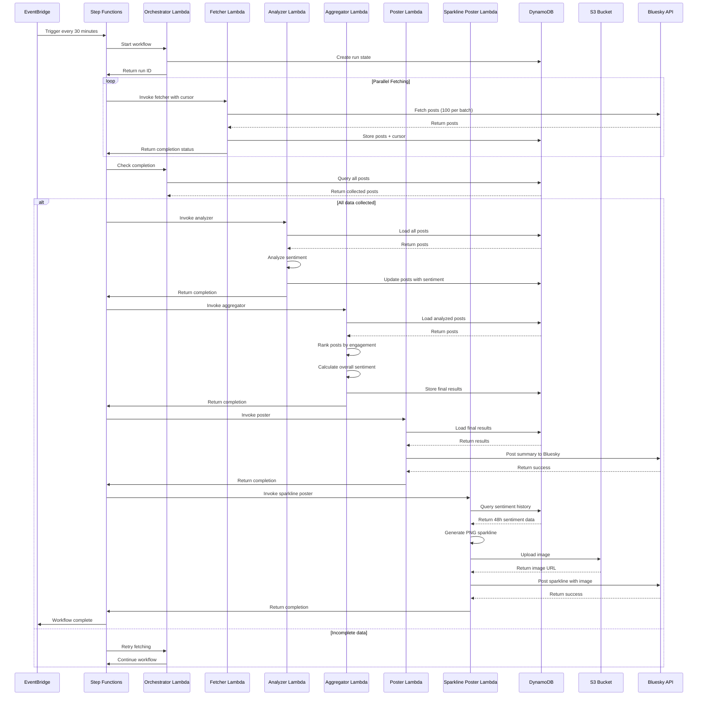
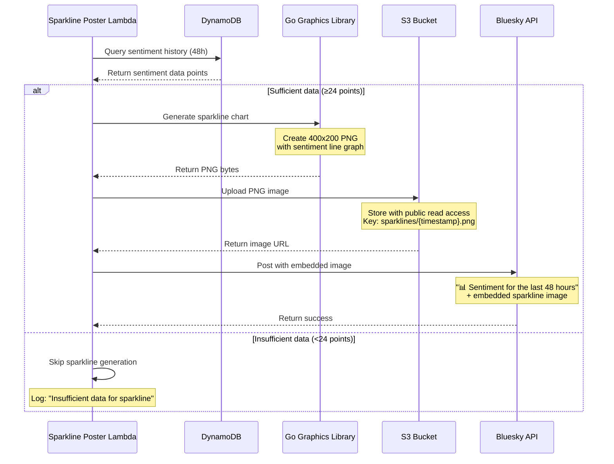
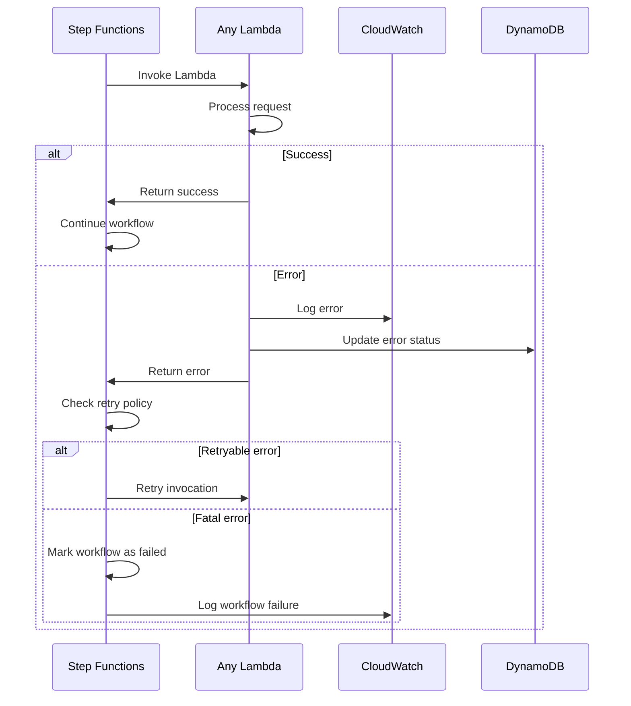
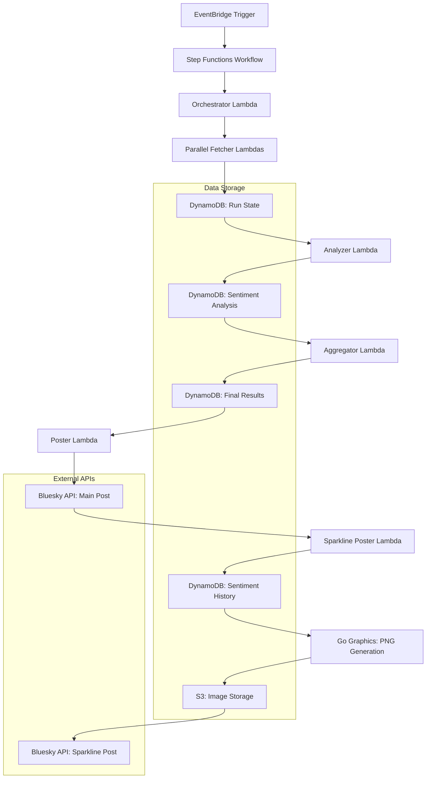
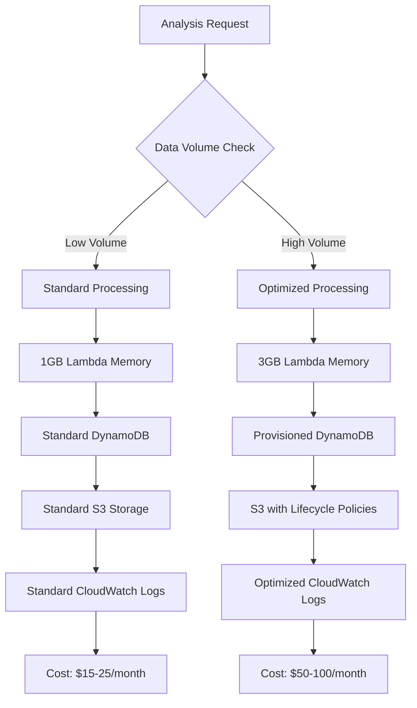
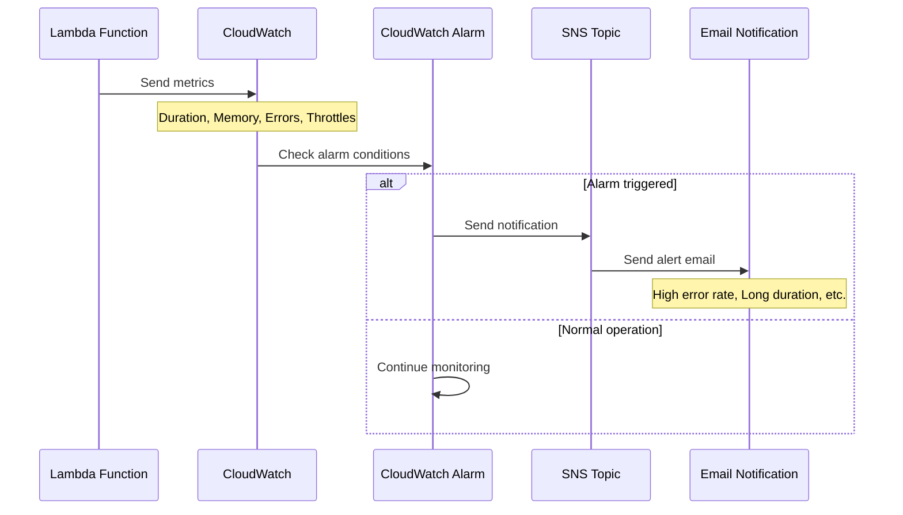
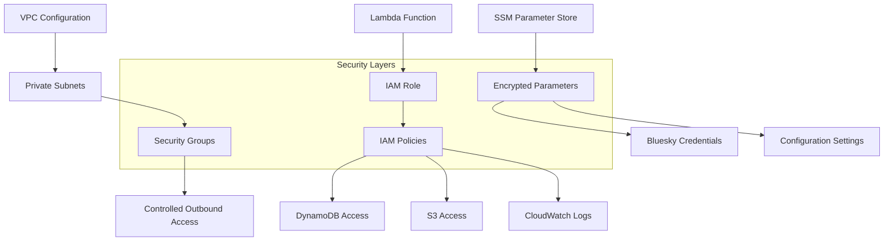
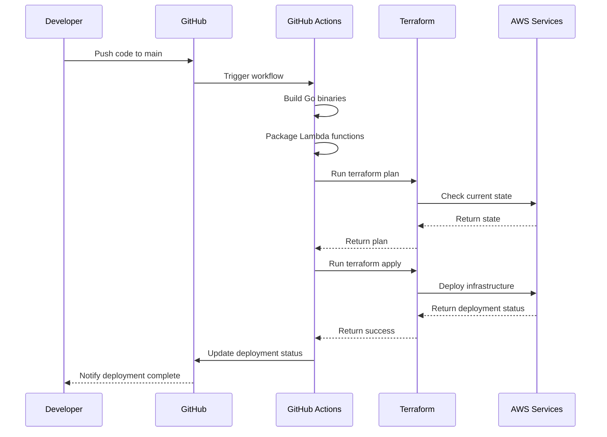

# Bluesky HourStats - Sequence Diagrams

This document contains detailed sequence diagrams showing the data flow and interactions between components in the Bluesky HourStats system.

## Main Analysis Workflow

## Sparkline Generation Workflow

## Error Handling Workflow

## Data Flow Architecture

## Cost Optimization Flow

## Monitoring and Alerting Flow

## Security and Access Control

## Deployment and CI/CD Flow

This comprehensive set of sequence diagrams provides a complete view of how the Bluesky HourStats system operates, from the initial trigger through data processing, error handling, monitoring, and deployment.
