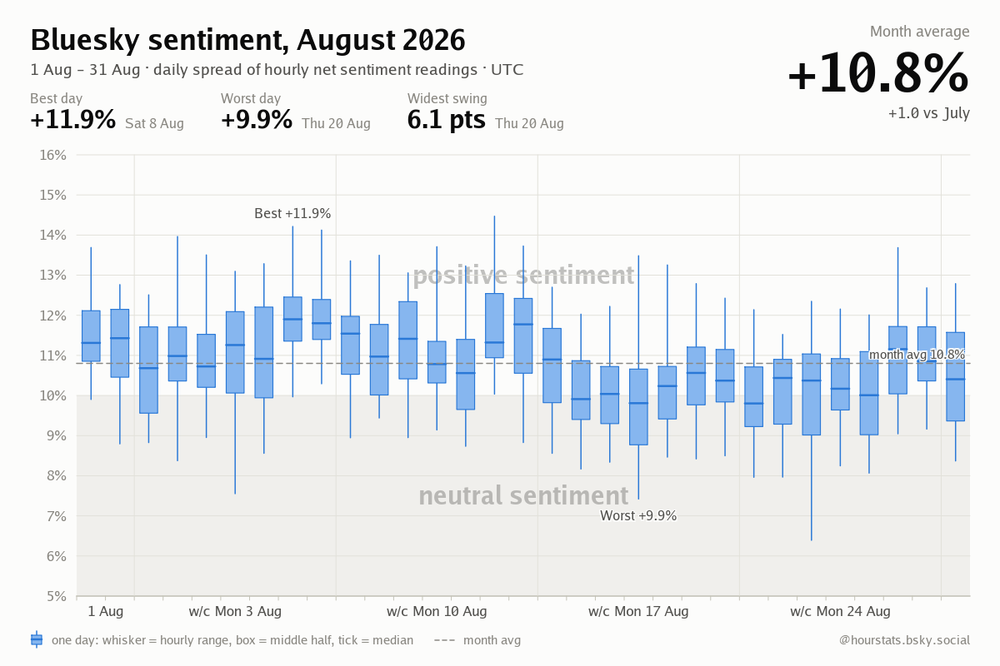
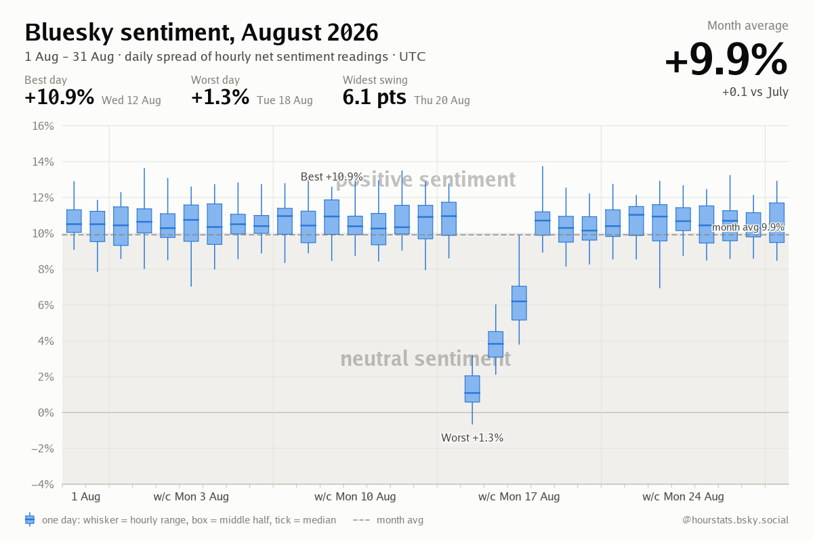
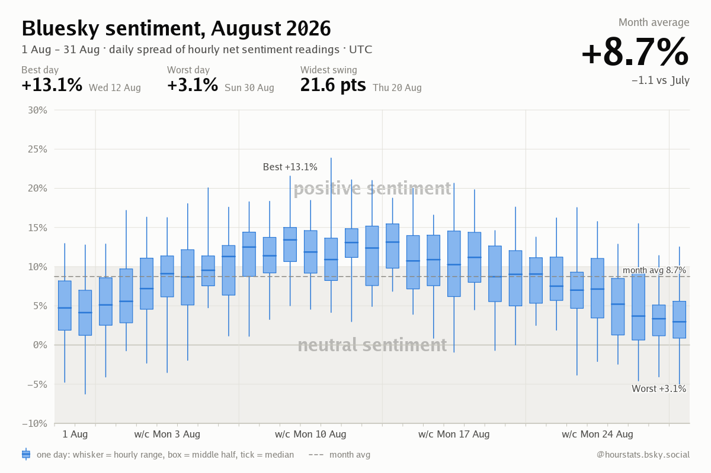
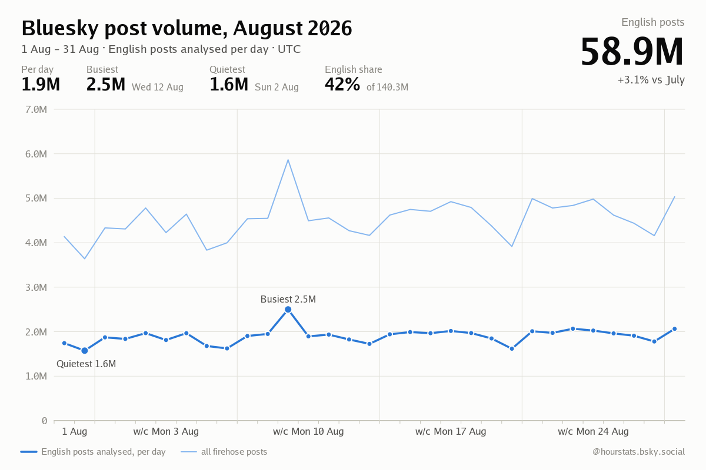
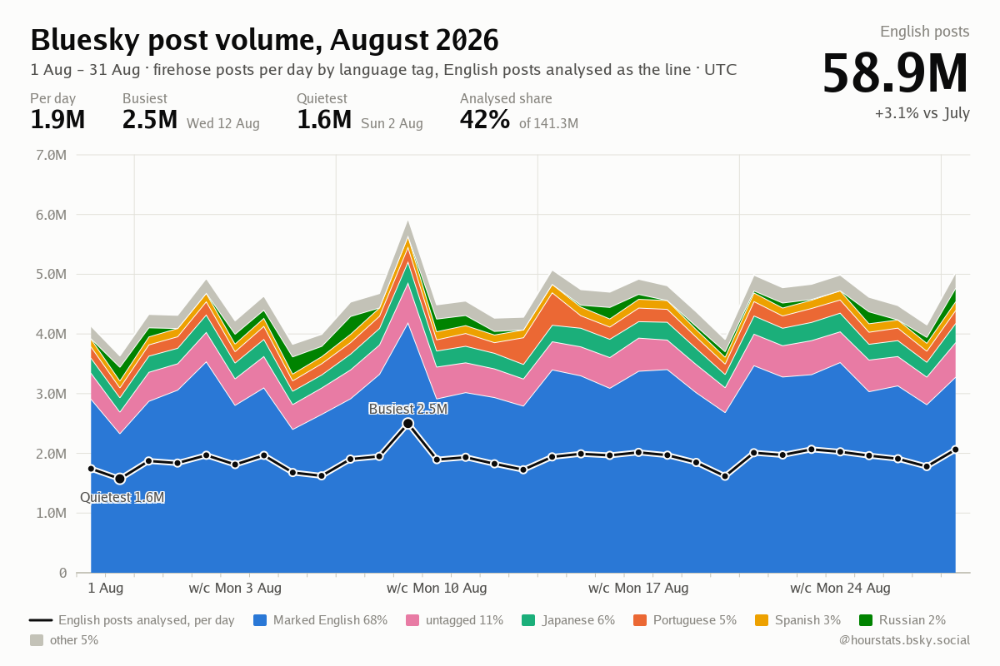

# Periodic report mockups

Mockups for two new scheduled posts. All numbers below are synthetic
(rendered from `go run ./cmd/graph-lab -type monthly`); the layout, wording
and data sources are what is being proposed.

## Weekly: week in review

**When:** Monday 00:xx UTC, in the daily-cycle goroutine after the daily
aggregation for Sunday has run. Covers Monday to Sunday of the previous week.

**Thread:** root post, then one reply that quotes the post of the week.
Both posted as standalone (not under the pinned yearly post) so they show in
the feed.

### Post 1 (root, text only, 242 graphemes)

```
Week in review · 25–31 Aug

Mood: +10.4% net positive, +0.6 vs the week before
Happiest day: Sat 30 Aug, +12.1%
Unhappiest day: Wed 27 Aug, +8.3%
Stickiest topic: Taylor Swift engagement, trending 31 of 168 hours

13.1M English posts analysed
```

Data sources:

| Line | Source | Cost |
|------|--------|------|
| Mood, delta | `daily_sentiment` (7 rows), previous 7 rows for the delta | trivial |
| Happiest / unhappiest day | `daily_sentiment.average_sentiment` max/min over the 7 rows | trivial |
| Stickiest topic | new `topic_daily` rollup (see below), sum of appearances over 7 days | trivial |
| Posts analysed | `daily_sentiment.total_posts` summed | trivial |

Open choices:
- "Stickiest topic" wording. Alternatives: "Most persistent topic",
  "Longest-running topic". Hours are counted as hourly snapshots the topic
  appeared in, out of 168 possible.
- Whether to attach the existing 7-day sparkline image. It is already posted
  hourly, so the mockup leaves it off.

### Post 2 (reply, quotes the post, 101 graphemes)

```
Post of the week · 25–31 Aug

Most engaged post by @nasa.gov: 48.2k likes, 9.1k reposts, 2.3k replies
```

Data source: new `daily_top_post` rollup (one row per day written by the
daily cycle), pick the max engagement score across the 7 rows. The existing
daily quote reply already looks this post up from `runs` (48h retention), so
the rollup just persists what that job already finds.

The quote embed should reuse the quote-control check the hourly summary
does, so a quote-controlled post degrades to a text mention.

## Monthly: candlestick and volume

**When:** 1st of the month 01:xx UTC, in the same job as the yearly chart,
right after it. Covers the previous calendar month.

**Thread:** root post with the candlestick chart, then a reply with the
volume chart.

### Post 1 (root, candlestick image, 252 graphemes)



```
August in review

Mood: +10.8% net positive, +1.0 vs July
Best day: Sat 8 Aug, +11.9%
Worst day: Thu 20 Aug, +9.9%
Widest hourly swing: Thu 20 Aug, 6.1 points

One candle per day: whisker is the hourly range, box is the middle half, tick is the median.
```

Two stress scenarios, to check the chart still reads when the month is not
calm:

| A three-day dip | A volatile month crossing zero |
|---|---|
|  |  |

Data source: `daily_sentiment` already stores min, q1, median, q3, max and
average per day, so this is rendering only. Candle colour follows the median
polarity (blue positive, orange negative), matching the sparkline.

### Post 2 (reply, volume image, 186 graphemes)

```
Post volume · August

58.9M English posts analysed, +3.1% vs July
1.9M per day on average
Busiest: Wed 12 Aug, 2.5M
Quietest: Sun 2 Aug, 1.6M
English share of the firehose: 42% of 140.3M
```

Chosen variant: English plus the full firehose as a soft line behind it.



The English-only rendering (`monthly-volume-english-only.png`) is what the
chart degrades to for days where firehose totals are not tracked.

### Stacked by language

When every day of the month has a language split (`language_daily`, collected
from the firehose since the language-volume change), the firehose line becomes
a stacked area: posts marked as English at the bottom (labelled "Marked
English", since that is wider than the English posts analysed), then the
largest languages up to five, then "other". Untagged posts get their own band when large enough. Colours are
pinned per language (English blue, Portuguese orange, Japanese aqua, Spanish
yellow, German magenta) so a language keeps its colour month to month; the
English-analysed line is drawn in ink with a surface halo over the fills.
The shares in the synthetic data mirror the first staging measurement
(English ~70%, untagged ~11%, Japanese ~6%, Portuguese ~5%).



Rendered by `go run ./cmd/graph-lab -type monthly` as
`test-results/graph-lab/monthly-volume-languages.png`. The post text gains a
`Next: Portuguese 5%, Japanese 6%, ...` line when it fits in 300 graphemes.

Data source: `daily_sentiment.total_posts` for English counts. Firehose
totals are only on `sentiment_history.total_firehose_posts`, so the share
tile either reads from there (works while that table is not purged) or a
`total_firehose_posts` column is added to `daily_sentiment` in the daily
aggregation. The mockup assumes the column is added.

## Rollup tables needed

Both written once a day inside the existing midnight daily cycle, so nothing
touches the hourly hot path.

```sql
CREATE TABLE topic_daily (
  date        TEXT NOT NULL,
  topic_id    TEXT NOT NULL,
  label       TEXT NOT NULL,
  appearances INTEGER NOT NULL,   -- hourly snapshots the topic was in
  best_rank   INTEGER NOT NULL,
  max_authors INTEGER NOT NULL,
  PRIMARY KEY (date, topic_id)
);

CREATE TABLE daily_top_post (
  date             TEXT PRIMARY KEY,
  uri              TEXT NOT NULL,
  cid              TEXT NOT NULL,
  author_handle    TEXT NOT NULL,
  likes            INTEGER NOT NULL,
  reposts          INTEGER NOT NULL,
  replies          INTEGER NOT NULL,
  engagement_score REAL NOT NULL
);
```

Roughly 20 rows a day for `topic_daily` and one for `daily_top_post`.
Retention 400 days so the annual report can use them later.

## Code in this worktree

- `internal/sparkline/monthly_candle_generator.go`: candlestick chart.
- `internal/sparkline/monthly_volume_generator.go`: volume line chart.
- `cmd/graph-lab/monthly.go`: synthetic month scenarios, `-type monthly`.

No store, scheduler or posting code yet; that is the beads work once the
mockups are agreed.
